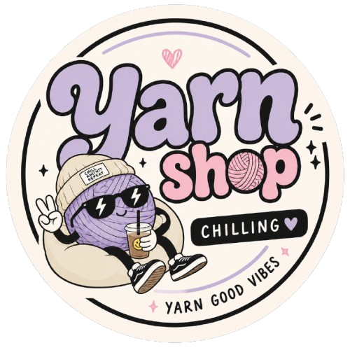
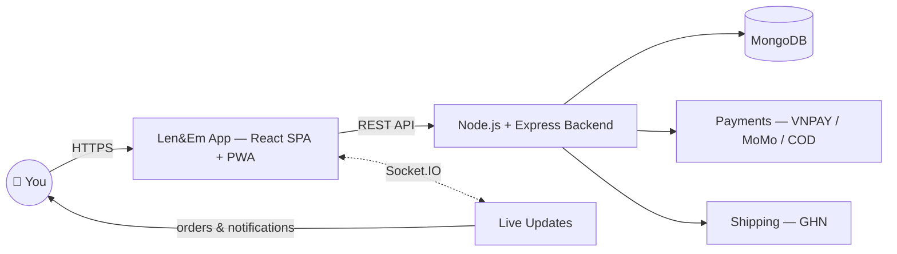

<div align="center">
  
  
  <h1 align="center" style="font-size: 2.5rem; font-weight: 700; margin-top: 0.5rem; background: linear-gradient(135deg, #f472b6, #8b5cf6); -webkit-background-clip: text; -webkit-text-fill-color: transparent; background-clip: text;">
    🧶 Len&Em
  </h1>

  <p align="center" style="font-size: 1.1rem; max-width: 640px; margin: 0 auto;">
    <strong>Learn it. Shop it. Make it — all in one place.</strong><br />
    Len&Em is a full-stack crochet universe: a real online store for yarn, hooks & kits,
    a structured learning academy, and a community where makers share their creations —
    wrapped in one fast, real-time, installable app.
  </p>

  <br />

  <!-- Badges -->
  <p>
    <a href="https://react.dev" target="_blank">
      
    </a>
    <a href="https://www.typescriptlang.org/" target="_blank">
      
    </a>
    <a href="https://tailwindcss.com/" target="_blank">
      
    </a>
    <a href="https://vitejs.dev/" target="_blank">
      
    </a>
    <br />
    <a href="https://tanstack.com/query/latest" target="_blank">
      
    </a>
    <a href="https://zustand.docs.pmnd.rs/" target="_blank">
      
    </a>
    <a href="https://socket.io/" target="_blank">
      
    </a>
    <a href="https://threejs.org/" target="_blank">
      
    </a>
  </p>

  <p>
    <a href="#-features">Features</a> •
    <a href="#-how-it-works">How It Works</a> •
    <a href="#-tech-stack">Tech Stack</a> •
    <a href="#-getting-started">Getting Started</a> •
    <a href="#-project-structure">Structure</a> •
    <a href="#-deployment">Deployment</a> •
    <a href="#-contributing">Contributing</a>
  </p>

  <br />
  <hr />
  <br />
</div>

---

## 🌟 Why Len&Em?

Most craft shops stop at a product page. **Len&Em is a complete ecosystem**, built with the care of a production-grade platform:

| | |
|---|---|
| 🛍️ **A real store** | Product variants & colors, curated kit bundles, live stock, GHN shipping, VNPAY / MoMo / COD checkout |
| 🎓 **A real academy** | Structured crochet courses, lesson-by-lesson progress tracking, and premium "Buy Now" courses |
| 🎨 **A real community** | A living DIY feed where makers share creations and cheer each other on |
| ⚡ **Real-time everywhere** | Orders, statuses & notifications pushed live over Socket.IO |
| 📱 **Runs anywhere** | Responsive web, installable PWA, plus Tauri desktop & Android apps |
| 🔐 **Built like a product** | JWT + Google sign-in, RBAC dashboards for User / Creator / Staff / Admin |

---

## ✨ Features

### 🛍️ E-Commerce
| Feature | Description |
|---------|-------------|
| **Product Catalog** | Browse yarn, tools, and kits with advanced filtering & search |
| **Kit Bundles** | Pre-packaged combo kits with discounted pricing |
| **Shopping Cart** | Full-featured cart with quantity management & kit savings |
| **Checkout** | Address management, GHN shipping integration, multiple payment methods |
| **Order Tracking** | Real-time order status with history & detail views |
| **Wishlist** | ❤️ Save items for later — wishlist with "Add all to cart" |

### 🎓 Learning Platform
| Feature | Description |
|---------|-------------|
| **Crochet Courses** | Structured courses sorted by skill level (Beginner → Advanced) |
| **Video Lessons** | Free quick tutorials with no login required |
| **Course Enrollment** | Enroll & track progress through lessons |
| **Premium Courses** | Love a paid course? One "Buy Now" with VNPAY — access unlocks after payment |
| **Material Tagging** | Every course tags exact yarn, tools & kits used |

### 🎨 Community (DIY)
| Feature | Description |
|---------|-------------|
| **DIY Feed** | Community-shared crochet projects & creations |
| **Create Posts** | Share your own projects with photos & descriptions |
| **Support DIY** | Upvote & support fellow makers' creations |

### 👤 User System
| Feature | Description |
|---------|-------------|
| **Authentication** | JWT-based login/register with password reset & OTP |
| **Google Sign-In** | One-tap Google OAuth login & registration |
| **Role-based Access** | User, Creator, Staff, Admin — each with tailored dashboards |
| **Profile Management** | Edit profile, manage addresses, view purchase history |
| **Membership Ranks** | Tiered loyalty system with perks & rewards |

### 🔧 Admin Panel
| Feature | Description |
|---------|-------------|
| **Dashboard** | Analytics overview with charts & KPIs |
| **User Management** | Manage users, roles, permissions |
| **Product Management** | CRUD for products, kits, inventory |
| **Order Management** | View & manage all orders, refunds |
| **Content Management** | Courses, lessons, DIY posts moderation |
| **Reports** | Sales, membership, and order reports |

### 🎯 Additional
| Feature | Description |
|---------|-------------|
| **🌐 Localization** | Vietnamese-first UI with a translation-ready `LanguageContext` |
| **🌙 Dark Mode** | Theme toggle with smooth transitions |
| **🤖 ChatBot** | AI-powered customer support assistant |
| **🔔 Real-time** | Live order & notification updates via Socket.IO |
| **📱 Responsive** | Mobile-first design with floating bottom nav & pull-to-refresh |
| **📲 PWA & Desktop** | Installable PWA + Tauri apps for Windows, macOS, Linux & Android |
| **🎬 Animations** | 3D scenes (Three.js) & scroll-triggered motion effects |
| **🗺️ Map Picker** | Leaflet-based address picker for checkout |

---

## 🎬 How It Works

### 🛍️ As a shopper
> Discover yarns, hooks & ready-to-go kits → filter by color, price & tags → pick your
> exact variant → fill the cart → pin your address on a live map → GHN calculates real
> shipping fees → pay with **VNPAY, MoMo or COD** → watch your order travel through
> every stage with real-time notifications.

### 🎓 As a learner
> Start with **free video lessons** — no account needed → enroll in structured courses →
> fall in love with a premium course? One **"Buy Now"** and it's yours → every completed
> lesson is saved to your progress → finish strong with a certificate.

### 🎨 As a maker
> Post your latest creation with photos & material tags → publish it to the community
> feed → get support from fellow makers → curated by admins to keep the feed inspiring.

### ⚙️ Under the hood



---

## 🛠️ Tech Stack

### Frontend
| Technology | Purpose |
|------------|---------|
| **React 18** | UI library with functional components & hooks |
| **TypeScript 5.8** | Type-safe development experience |
| **Vite 8** | Fast build tool & dev server with HMR |
| **Tailwind CSS 4** | Utility-first CSS framework |
| **TanStack Query 5** | Server state management & caching |
| **Zustand 5** | Lightweight client state management |
| **React Router 7** | Client-side routing & navigation |
| **React Hook Form** | Performant form management |
| **Yup** | Schema validation |
| **Axios** | HTTP client with interceptors |
| **Socket.IO Client** | Real-time bidirectional communication |
| **Three.js / React Three Fiber** | 3D animations & backgrounds |
| **Motion** | Animation library (formerly Framer Motion) |
| **Recharts** | Charts & data visualization |
| **Leaflet** | Interactive maps for address picking |
| **Lucide React** | Consistent icon library |
| **Radix UI** | Accessible, unstyled UI primitives |
| **Sonner** | Toast notifications |
| **date-fns** | Date formatting & manipulation |
| **vite-plugin-pwa** | PWA support — manifest, service worker, offline app shell |
| **Tauri 2** | Desktop (Windows/macOS/Linux) & Android packaging |

### Backend (separate repository)
- **Node.js + Express** — RESTful API
- **MongoDB + Mongoose** — NoSQL database
- **JWT** — Authentication & authorization
- **Socket.IO** — Real-time events
- **GHN API** — Shipping integration

---

## 🚀 Getting Started

### Prerequisites
- **Node.js** >= 20.19 (22 LTS recommended — required by Vite 8)
- **npm** >= 9.x

### Run it locally

```bash
# 1. Clone the repository
git clone https://github.com/Kamui6607/Len-Em.git
cd Len-Em/FE

# 2. Install dependencies
npm install

# 3. Start the development server
npm run dev
```

Open **http://localhost:5173** and start stitching! 🧶
The Vite dev server proxies `/api/*` and `/socket.io/*` to the backend, so the full experience works out of the box.

### Available Scripts

| Command | Description |
|---------|-------------|
| `npm run dev` | Start development server with HMR |
| `npm run build` | Type-check & build for production |
| `npm run preview` | Preview production build locally |
| `npm run lint` | Run ESLint across the codebase |
| `npm run tauri` | Run / build the Tauri desktop & Android apps |

---

## 📁 Project Structure

```
src/
├── main.tsx               # Entry point — imports global styles & renders <App/>
├── app/                   # App-level composition (pages + 1 data file)
│   ├── App.tsx            # Root component: QueryClientProvider + context provider tree + router
│   ├── data/              # Static catalog mock data (products, helpers)
│   └── pages/             # Feature pages, grouped by role/domain
│       ├── admin/         # Admin dashboard & management (products, orders, users, roles, ...)
│       ├── auth/          # Login, Register, Forgot/Reset Password
│       ├── creator/       # Creator dashboard & content management
│       ├── manage/        # Order management (staff/manage view)
│       ├── membership/    # Membership & loyalty
│       ├── shop/          # Cart, Checkout, My Orders, Order Detail, Order Success
│       ├── staff/         # Staff dashboard & reports
│       ├── supportDIY/    # Support DIY creation
│       └── *.tsx          # Home, Shop, ProductDetail, kits, learn, DIY, etc.
├── features/              # Domain modules — each owns its service + types (and store/data if needed)
│   ├── creator/           # Creator mock data
│   ├── diy/               # DIY (services, types)
│   ├── learn/             # Learn (data, store, types)
│   ├── membership/        # Membership (data, store, types)
│   ├── orderReport/       # Order report (services, types)
│   ├── orders/            # Orders (services, types)  ← canonical order service
│   ├── shop/              # Shop product service (adapter + fetch)
│   ├── supportDIY/        # Support DIY (services, types)
│   └── users/             # Users (services)
├── lib/                   # Framework/tool wrappers (axiosClient, queryClient, formatPrice, authUtils, roleGuard)
├── locales/               # i18n dictionary (vi.json) — Vietnamese-first, translation-ready
├── routes/                # Route definitions & AppRouter
├── shared/                # Cross-cutting code reused across features
│   ├── api/               # API services (auth, kit, course, lesson, product, ghn, ...)
│   ├── components/        # Reusable UI & layout components
│   │   ├── admin/         # Admin-specific shared components
│   │   ├── auth/          # Auth guards (RequireAuth, RequireRole)
│   │   ├── dashboard/     # Dashboard shell & sidebars
│   │   ├── filters/       # Filter/search/sort controls
│   │   ├── layout/        # Store layout, navigation shell
│   │   ├── map/           # Leaflet map picker
│   │   ├── membership/    # Membership UI components
│   │   ├── mobile/        # Mobile-specific (BottomNav, ScrollToTop)
│   │   ├── motion/        # Animation components (Reveal, ScrollProgress, ...)
│   │   ├── order/         # Order UI components
│   │   ├── search/        # Search controls
│   │   ├── skeletons/     # Loading skeletons
│   │   └── ui/            # Low-level primitives (shadcn/ui-style) — button, card, dialog, ...
│   ├── contexts/          # React contexts (Cart, Favorites, Theme, Language, Admin, ...)
│   ├── hooks/             # Custom React hooks
│   ├── store/             # Zustand stores (auth; feature stores live under features/)
│   └── types/             # Shared TypeScript types (auth, product, catalog, order, api, ...)
├── constants/             # App-wide constants
└── styles/                # Global styles, theme, fonts, page-specific css
```

Outside `src/`:

```
FE/
├── src-tauri/             # Tauri 2 shell — desktop (Windows/macOS/Linux) & Android
├── public/                # Static assets & PWA icons
├── vercel.json            # SPA rewrite for Vercel
└── vite.config.ts         # Dev proxy, PWA manifest & smart chunk-splitting
```

---

## 🚢 Deployment

| Target | How |
|--------|-----|
| **Web (PWA)** | Production build is served as a static SPA — `vercel.json` rewrites every route to `index.html`. |
| **Desktop & Android** | GitHub Actions builds Tauri installers + APK and attaches them to a GitHub Release on every `app-v*` tag. |

> 🔐 **Security & privacy:** all sensitive configuration lives in gitignored environment files provisioned at deploy time — no credentials, keys, or private endpoints are stored in this repository.

---

## 🤝 Contributing

1. **Fork** the repository
2. **Create a feature branch**: `git checkout -b feat/your-feature`
3. **Commit** your changes: `git commit -m 'feat: add some feature'`
4. **Push** to the branch: `git push origin feat/your-feature`
5. **Open a Pull Request**

### Commit Convention

We follow [Conventional Commits](https://www.conventionalcommits.org/):

- `feat:` — A new feature
- `fix:` — A bug fix
- `refactor:` — Code refactoring
- `style:` — Formatting, missing semicolons, etc.
- `docs:` — Documentation only changes
- `chore:` — Build process or tooling changes

---

## 📄 License

This project is developed for educational purposes as part of the **EXE101** course at **FPT University**.

---

<div align="center">
  <br />
  <p>
    Made with ❤️ and 🧶 by the Len&Em Team
  </p>
  <p>
    <a href="https://github.com/Kamui6607/Len-Em" target="_blank">
      
    </a>
  </p>
  <br />
</div>